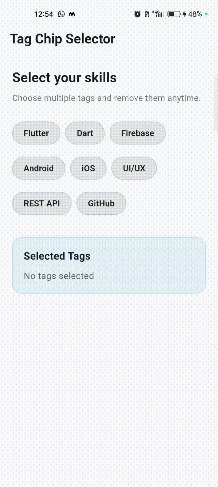

# flutter_tag_chip_selector

A clean, reusable, and customizable Flutter package for creating **multi-select tag/chip selectors** with removable chips, dynamic colors, custom styling, and real-time selection updates.

<p align="center">
  
</p>

## ✨ Features

* ✅ Multi-select chips
* ✅ Removable selected chips
* ✅ Dynamic chip colors
* ✅ Custom selected color
* ✅ Custom unselected color
* ✅ Custom text colors
* ✅ Individual tag colors
* ✅ Real-time selection callback
* ✅ Initial selected tags
* ✅ Material 3 support
* ✅ Responsive layout using `Wrap`
* ✅ Custom spacing
* ✅ Custom border radius
* ✅ Lightweight and reusable
* ✅ Clean package architecture
* ✅ Widget tests included
* ✅ Example application included

---

# 📦 Installation

## Step 1 — Add Dependency

Open your Flutter project's `pubspec.yaml` file.

Add:

```yaml
dependencies:
  flutter_tag_chip_selector: ^1.0.0
```

Then save the file.

---

## Step 2 — Install Package

Run:

```bash
flutter pub get
```

---

## Step 3 — Import Package

Open the Dart file where you want to use the widget.

Add:

```dart
import 'package:flutter_tag_chip_selector/flutter_tag_chip_selector.dart';
```

---

# 🚀 Basic Usage

## Step 1 — Create Tags

Create a list of `TagItem` objects:

```dart
final List<TagItem> tags = const [
  TagItem(label: 'Flutter'),
  TagItem(label: 'Dart'),
  TagItem(label: 'Firebase'),
  TagItem(label: 'Android'),
  TagItem(label: 'iOS'),
];
```

---

## Step 2 — Create Selected Tags List

```dart
List<String> selectedTags = [];
```

---

## Step 3 — Add `TagChipSelector`

```dart
TagChipSelector(
  tags: tags,
  selectedTags: selectedTags,
  onSelectionChanged: (values) {
    setState(() {
      selectedTags = values;
    });
  },
)
```

---

# 🎯 Complete Example

Here is a complete working example:

```dart
import 'package:flutter/material.dart';
import 'package:flutter_tag_chip_selector/flutter_tag_chip_selector.dart';

class TagExample extends StatefulWidget {
  const TagExample({super.key});

  @override
  State<TagExample> createState() => _TagExampleState();
}

class _TagExampleState extends State<TagExample> {
  List<String> selectedTags = [];

  final List<TagItem> tags = const [
    TagItem(label: 'Flutter'),
    TagItem(label: 'Dart'),
    TagItem(label: 'Firebase'),
    TagItem(label: 'Android'),
    TagItem(label: 'iOS'),
    TagItem(label: 'GitHub'),
  ];

  @override
  Widget build(BuildContext context) {
    return Scaffold(
      appBar: AppBar(
        title: const Text('Tag Chip Selector'),
      ),
      body: Padding(
        padding: const EdgeInsets.all(20),
        child: Column(
          crossAxisAlignment: CrossAxisAlignment.start,
          children: [
            TagChipSelector(
              tags: tags,
              selectedTags: selectedTags,
              onSelectionChanged: (values) {
                setState(() {
                  selectedTags = values;
                });
              },
            ),

            const SizedBox(height: 30),

            Text(
              'Selected: ${selectedTags.join(', ')}',
            ),
          ],
        ),
      ),
    );
  }
}
```

---

# 🔥 Multi-Select

The widget supports selecting multiple tags at the same time.

```dart
TagChipSelector(
  tags: const [
    TagItem(label: 'Flutter'),
    TagItem(label: 'Dart'),
    TagItem(label: 'Firebase'),
    TagItem(label: 'Android'),
  ],
  onSelectionChanged: (selected) {
    print(selected);
  },
)
```

Example callback result:

```text
[Flutter, Dart, Firebase]
```

---

# ❌ Removable Chips

Selected chips display a close icon by default.

```dart
TagChipSelector(
  tags: const [
    TagItem(label: 'Flutter'),
    TagItem(label: 'Dart'),
    TagItem(label: 'Firebase'),
  ],
  removable: true,
)
```

Tap the close icon to remove the selected tag.

---

## Disable Removing

If you don't want the close icon:

```dart
TagChipSelector(
  tags: const [
    TagItem(label: 'Flutter'),
    TagItem(label: 'Dart'),
  ],
  removable: false,
)
```

---

# 🎨 Dynamic Colors

Dynamic colors are enabled by default.

```dart
TagChipSelector(
  tags: const [
    TagItem(label: 'Flutter'),
    TagItem(label: 'Dart'),
    TagItem(label: 'Firebase'),
    TagItem(label: 'Android'),
  ],
  dynamicColors: true,
)
```

Each selected chip automatically receives a color from the built-in color palette.

---

# 🎨 Custom Selected Color

You can use one custom color for selected chips:

```dart
TagChipSelector(
  tags: const [
    TagItem(label: 'Flutter'),
    TagItem(label: 'Dart'),
    TagItem(label: 'Firebase'),
  ],
  selectedColor: Colors.deepPurple,
)
```

---

# 🌈 Individual Tag Colors

Every tag can have its own selected color.

```dart
TagChipSelector(
  tags: const [
    TagItem(
      label: 'Flutter',
      color: Colors.blue,
    ),
    TagItem(
      label: 'Firebase',
      color: Colors.orange,
    ),
    TagItem(
      label: 'Dart',
      color: Colors.indigo,
    ),
  ],
)
```

---

# 🖌️ Custom Styling

You can customize selected and unselected chip colors.

```dart
TagChipSelector(
  tags: const [
    TagItem(label: 'Flutter'),
    TagItem(label: 'Dart'),
    TagItem(label: 'Firebase'),
  ],
  selectedColor: Colors.blue,
  unselectedColor: Colors.grey.shade200,
  selectedTextColor: Colors.white,
  unselectedTextColor: Colors.black87,
)
```

---

# 📐 Spacing

Customize horizontal chip spacing:

```dart
TagChipSelector(
  tags: tags,
  spacing: 12,
)
```

Customize vertical spacing:

```dart
TagChipSelector(
  tags: tags,
  runSpacing: 16,
)
```

Both together:

```dart
TagChipSelector(
  tags: tags,
  spacing: 12,
  runSpacing: 16,
)
```

---

# 🔵 Border Radius

Customize chip corner radius:

```dart
TagChipSelector(
  tags: tags,
  borderRadius: 24,
)
```

---

# ⚡ Real-Time Selection

The `onSelectionChanged` callback provides the latest selected tags immediately.

```dart
TagChipSelector(
  tags: tags,
  onSelectionChanged: (selected) {
    setState(() {
      selectedTags = selected;
    });

    print('Selected Tags: $selected');
  },
)
```

Example output:

```text
Selected Tags: [Flutter, Dart]
```

After adding Firebase:

```text
Selected Tags: [Flutter, Dart, Firebase]
```

After removing Dart:

```text
Selected Tags: [Flutter, Firebase]
```

---

# 🧩 API Reference

## TagChipSelector

| Property              | Type                          | Default  | Description                       |
| --------------------- | ----------------------------- | -------- | --------------------------------- |
| `tags`                | `List<TagItem>`               | Required | List of available tags            |
| `selectedTags`        | `List<String>`                | `[]`     | Initially selected tags           |
| `onSelectionChanged`  | `ValueChanged<List<String>>?` | `null`   | Called whenever selection changes |
| `removable`           | `bool`                        | `true`   | Enables close/remove icon         |
| `dynamicColors`       | `bool`                        | `true`   | Enables automatic colors          |
| `selectedColor`       | `Color?`                      | `null`   | Common selected color             |
| `unselectedColor`     | `Color?`                      | `null`   | Unselected background color       |
| `selectedTextColor`   | `Color?`                      | `null`   | Selected text color               |
| `unselectedTextColor` | `Color?`                      | `null`   | Unselected text color             |
| `spacing`             | `double`                      | `8`      | Horizontal spacing                |
| `runSpacing`          | `double`                      | `10`     | Vertical spacing                  |
| `borderRadius`        | `double`                      | `20`     | Chip border radius                |

---

# 🏷️ TagItem

`TagItem` represents an individual selectable tag.

```dart
TagItem(
  label: 'Flutter',
)
```

## Individual Color

```dart
TagItem(
  label: 'Flutter',
  color: Colors.blue,
)
```

### Properties

| Property | Type     | Description                        |
| -------- | -------- | ---------------------------------- |
| `label`  | `String` | Tag text                           |
| `color`  | `Color?` | Optional individual selected color |

---

# 📱 Example Application

This repository contains a complete example application.

## Step 1 — Open Example

From the package root:

```bash
cd example
```

## Step 2 — Get Dependencies

```bash
flutter pub get
```

## Step 3 — Analyze Example

```bash
flutter analyze
```

Expected:

```text
No issues found!
```

## Step 4 — Run Example

```bash
flutter run
```

> `flutter run` must be executed from the `example` directory because this is a Flutter package and the package root does not contain `lib/main.dart`.

---

# 🧪 Testing

## Run Package Tests

From package root:

```bash
flutter test
```

Expected:

```text
+4: All tests passed!
```

## Analyze Package

```bash
flutter analyze
```

Expected:

```text
No issues found!
```

## Analyze Example

```bash
cd example
flutter analyze
```

Expected:

```text
No issues found!
```

## Run Example Tests

```bash
flutter test
```

Expected:

```text
+1: All tests passed!
```

---

# 📁 Project Structure

```text
flutter_tag_chip_selector/
│
├── assets/
│   └── demo.gif
│
├── example/
│   ├── android/
│   ├── ios/
│   ├── lib/
│   │   └── main.dart
│   ├── test/
│   │   └── widget_test.dart
│   └── pubspec.yaml
│
├── lib/
│   ├── flutter_tag_chip_selector.dart
│   │
│   └── src/
│       ├── models/
│       │   └── tag_item.dart
│       │
│       ├── utils/
│       │   └── chip_colors.dart
│       │
│       └── widgets/
│           └── tag_chip_selector.dart
│
├── test/
│   └── flutter_tag_chip_selector_test.dart
│
├── LICENSE
├── README.md
└── pubspec.yaml
```

---

# 🏗️ Architecture

The package follows a clean and simple structure:

```text
Models
   ↓
Utilities
   ↓
Widgets
   ↓
Public Package API
```

### Models

Contains reusable data models.

```text
lib/src/models/
```

### Utils

Contains reusable helper functionality.

```text
lib/src/utils/
```

### Widgets

Contains the main reusable UI component.

```text
lib/src/widgets/
```

### Public API

Users only need to import:

```dart
import 'package:flutter_tag_chip_selector/flutter_tag_chip_selector.dart';
```

---

# 💡 Use Cases

This package is useful for:

* 👨‍💻 Skills selection
* 🎯 Interest selection
* 🏷️ Category selection
* 🔎 Search filters
* 🛍️ Product filters
* 👤 Profile preferences
* 📱 Technology selection
* 📝 Multi-select forms
* 📚 Course categories
* 🎨 Content tags

---

# ⚙️ Requirements

* Flutter
* Dart
* Material 3 compatible Flutter application

---

# 🔄 Complete Development Workflow

Clone the repository:

```bash
git clone https://github.com/sufiyanshaikh-1304/flutter_tag_chip_selector.git
```

Enter the project:

```bash
cd flutter_tag_chip_selector
```

Get dependencies:

```bash
flutter pub get
```

Run package analysis:

```bash
flutter analyze
```

Run tests:

```bash
flutter test
```

Run the example:

```bash
cd example
flutter pub get
flutter run
```

---

# 🌿 Git Branches

The project uses the following branches:

```text
stage
master
development
```

## Switch to Stage

```bash
git checkout stage
```

## Switch to Development

```bash
git checkout development
```

## Switch to Master

```bash
git checkout master
```

---

# 📸 Demo

The demo animation is stored at:

```text
example/assets/demo.gif
```

The README displays it using:

```html
<p align="center">
  
</p>
```

The image width is intentionally set to **200px** for a clean GitHub README layout.

---

# 🤝 Contributing

Contributions are welcome.

1. Fork the repository.
2. Create a feature branch.
3. Make your changes.
4. Add or update tests.
5. Run `flutter analyze`.
6. Run `flutter test`.
7. Submit a pull request.

Example:

```bash
git checkout -b feature/new-feature
```

```bash
flutter analyze
```

```bash
flutter test
```

---

# 📄 License

This project is licensed under the MIT License.

Copyright (c) 2026 Excelsior Technologies
 
Permission is hereby granted, free of charge, to any person obtaining a copy
of this software and associated documentation files (the "Software"), to deal
in the Software without restriction, including without limitation the rights
to use, copy, modify, merge, publish, distribute, sublicense, and/or sell
copies of the Software, and to permit persons to whom the Software is
furnished to do so, subject to the following conditions:
 
The above copyright notice and this permission notice shall be included in all
copies or substantial portions of the Software.
 
THE SOFTWARE IS PROVIDED "AS IS", WITHOUT WARRANTY OF ANY KIND, EXPRESS OR
IMPLIED, INCLUDING BUT NOT LIMITED TO THE WARRANTIES OF MERCHANTABILITY,
FITNESS FOR A PARTICULAR PURPOSE AND NONINFRINGEMENT. IN NO EVENT SHALL THE
AUTHORS OR COPYRIGHT HOLDERS BE LIABLE FOR ANY CLAIM, DAMAGES OR OTHER
LIABILITY, WHETHER IN AN ACTION OF CONTRACT, TORT OR OTHERWISE, ARISING FROM,
OUT OF OR IN CONNECTION WITH THE SOFTWARE OR THE USE OR OTHER DEALINGS IN THE
SOFTWARE. 

---

# 👨‍💻 Author

Developed as a reusable Flutter UI package for production-oriented mobile application development.

## ⭐ Support

If this package is useful for your Flutter project, consider giving the repository a ⭐ on GitHub.
